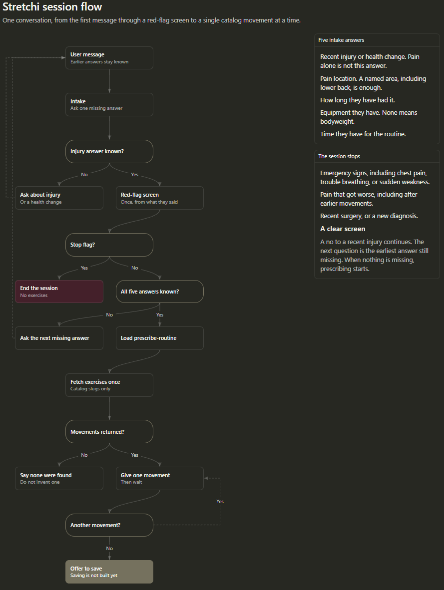

# Stretchi

Stretchi gives pain-relief instruction. It asks only for intake answers that are still missing, screens for reasons to stop, and then prescribes one catalog movement at a time. It does not diagnose, and it does not replace a clinician.

The agent is an [Eve](https://eve.dev) app in `stretchi/`. Eve is Vercel's filesystem-first agent framework. Identity and session order live in markdown, skills are markdown files the agent loads during a session, and tools are TypeScript modules. Evals sit next to the agent and run as a test suite.

## Session flow

1. **Intake.** Collect five answers: a recent injury or health change, pain location, how long it has lasted, available equipment, and time. Ask one missing answer per turn. A named body area, including "lower back," is a known location. Pain by itself is not an injury answer.
2. **Red flags.** As soon as the injury answer is known, screen before any later question or exercise. A clear "no" continues. Stop, with no exercises, for an emergency, worsening pain, recent surgery, or a new diagnosis.
3. **Prescribe.** Load the prescribe skill, then look up the catalog once. Map the person's words onto catalog slugs, such as `back` and `bodyweight`. No equipment is bodyweight. Keep that list and give one movement per turn. Choose 1 to 4 movements from the time they have, and never give a fifth.
4. **Close.** Offer to save the routine. Saving is not implemented yet.



## Layout

- `stretchi/agent/instructions.md` — identity, hard rules, and session order
- `stretchi/agent/skills/` — `intake`, `check-redflags`, and `prescribe-routine`
- `stretchi/agent/tools/fetch-exercise-from-intake.ts` — GraphQL catalog lookup, limited to catalog slugs
- `stretchi/evals/` — intake continuity, red-flag refusal, catalog lookup, and off-topic refusal

The exercise catalog is served by a separate GraphQL backend. This agent calls it with `GRAPHQL_SERVER_URL`.

## Run

From `stretchi/`:

```bash
npm run dev
npx eve eval
npm run typecheck
```

`npm run dev` opens a local session. `npx eve eval` runs the suite. Pass an eval id to run one case, for example `npx eve eval intake/no-repeated-questions`. Set `OPENAI_API_KEY` and `GRAPHQL_SERVER_URL` in `stretchi/.env.local`. Eval judging uses that OpenAI key.
